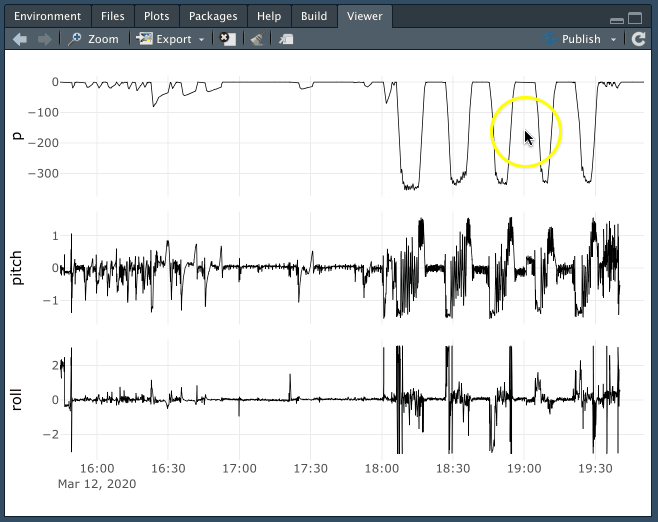
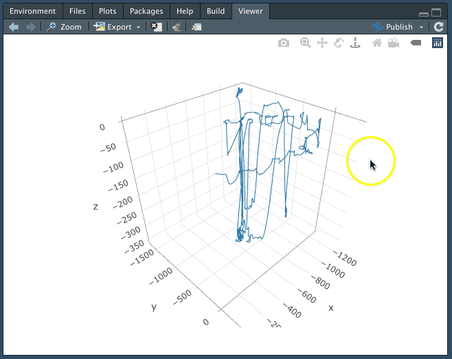

<!-- README.md is generated from README.Rmd. Please edit that file -->

```{r, include = FALSE}
knitr::opts_chunk$set(
  collapse = TRUE,
  comment = "#>",
  fig.path = "man/figures/README-",
  out.width = "100%"
)
```

# catsr

<!-- badges: start -->
[](https://github.com/FlukeAndFeather/catsr/actions)
[](https://codecov.io/gh/FlukeAndFeather/catsr)
<!-- badges: end -->

catsr is an R package for reading and visualizing CATS PRH files. For information on the PRH creation tools and workflow, see [CATS-Methods-Materials](https://github.com/wgough/CATS-Methods-Materials) and the [CATS Data Processing Workshop](https://catsworkshop.sites.stanford.edu/).

## Installation

catsr is available on [GitHub](https://github.com/) and you can install it using devtools package. If you don't have devtools installed, uncomment the line below. See section **Troubleshooting** at the end of this document for common errors.

``` r
# install.packages("devtools")
devtools::install_github("FlukeAndFeather/catsr")
```


## Reading data

Read a CATS PRH file in netCDF format with read_nc(). The .nc file for deployment mn200312-58 is included in the package. Note: triaxial variables (aw, mw, gw) are stored as three-column matrices, so only the first column (corresponding to the x-axis) shows up in View(). 

```{r read}
library(catsr)
nc_path <- system.file("extdata", "mn200312-58_prh10.nc", package = "catsr")
mn200312_58_from_nc <- read_nc(nc_path)
mn200312_58_from_nc
```

## Visualizing data

Examine PRH variables (e.g. depth, pitch, and roll) in an interactive plot with view_cats(). This package also provides deployment mn200312-58 directly for use in R.  

```{r plot, eval=FALSE}
view_cats(mn200312_58, c("p", "pitch", "roll"))
```


Triaxial variables (such as accelerometry - `aw`) are represented in multiple colors.

```{r plot_triax, eval=FALSE}
view_cats(mn200312_58, c("p", "aw", "mw"))
```


Explore the animal's 3d movement trajectory.

```{r plot_3d, eval=FALSE}
view_cats_3d(mn200312_58)
```


## Troubleshooting

*All platforms:*

If you encounter an error installing catsr (or devtools), close all instances of R (including RStudio). Start a new session and run the install command again.

*Windows:*

Installing devtools on R>=4.0.0 requires [Rtools40](https://cran.r-project.org/bin/windows/Rtools/). 

*Mac OSX:*

Installing devtools on Mac OSX requires Command Line Tools. In your terminal, run `xcode-select --install`.
