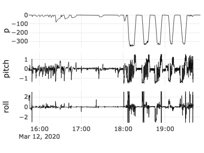
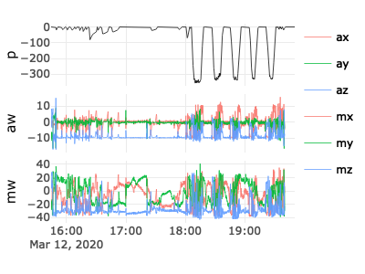

catsr\_readme
================

<!-- README.md is generated from README.Rmd. Please edit that file -->

# catsr

<!-- badges: start -->

[](https://github.com/FlukeAndFeather/catsr/actions)
[](https://codecov.io/gh/FlukeAndFeather/catsr)
<!-- badges: end -->

catsr reads and visualizes CATS PRH files.

## Installation

You can install catsr from [GitHub](https://github.com/) with:

``` r
# install.packages("devtools")
devtools::install_github("FlukeAndFeather/catsr")
```

## Reading data

Read a CATS PRH file in NetCDF format. The .nc file for deployment
mn200312-58 is included in the package.

``` r
library(catsr)
nc_path <- system.file("extdata", "mn200312-58_prh10.nc", package = "catsr")
mn200312_58_from_nc <- read_nc(nc_path)
```

## Visualizing data

Examine PRH variables (e.g. depth, pitch, and roll) in an interactive
plot. This package also provides deployment mn200312-58 directly for use
in R (`mn200312_58`). GitHub READMEs don’t support interaction, so we
show a screenshot here instead.

``` r
view_cats(mn200312_58, c("p", "pitch", "roll"))
```



Triaxial variables (such as accelerometry - `aw`) are represented in
multiple colors.

``` r
view_cats(mn200312_58, c("p", "aw", "mw"))
```



Explore the animal’s 3d movement trajectory.

``` r
view_cats_3d(mn200312_58)
```


